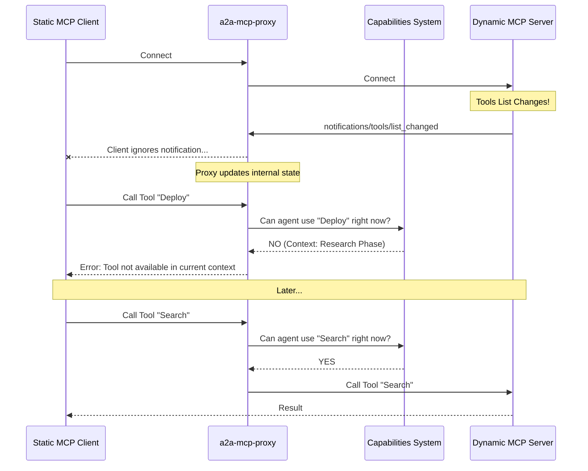

# a2a-mcp-proxy

> **using the Agent2Agent protocol, at great expense, to polyfill the parts of the MCP spec that most MCP clients ignore**

## The Problem

The [Model Context Protocol (MCP)](https://modelcontextprotocol.io/) is a powerful standard, but client compliance is... spotty.

The most glaring omission? **Dynamic Updates.**

The MCP spec includes `notifications/tools/list_changed` and `notifications/resources/list_changed`. These are crucial for a living, breathing agentic ecosystem where tools and resources appear and disappear based on context.

Most clients ignore these. They fetch the list once at startup and never look back. This breaks any server attempting to provide context-aware tooling.

## The Solution

**a2a-mcp-proxy** is the brute-force solution to this problem.

It acts as a middleware proxy between your MCP Client and the MCP Server. It polyfills the dynamic nature of the protocol that your client is ignoring.

### 1. The "Expensive" Polyfill
When the server notifies that tools or resources have changed, but the client is deaf to the notification, the proxy steps in. It manages the state of the world that the client *should* be seeing.

### 2. The Capabilities System (Augmented MCP)
We don't just patch the holes; we upgrade the pavement.

**a2a-mcp-proxy** introduces a **Capabilities System**. This ensures that a client agent can only access tools and resources appropriate to its *current situation*.

*   **Per-Tool & Per-Resource Access Control**: Access isn't binary. It's situational.
*   **Context-Aware Visibility**: If an agent shouldn't see a tool right now (e.g., "Deploy to Production" when in a "Research" phase), this proxy hides it.
*   **Dynamic Enforcement**: As the agent's context changes, so do its capabilities. The proxy enforces this in real-time, even if the client is trying to use a stale tool definition.

### Architecture

## "At Great Expense"

Why is this funny? Because it's true.

We are literally using a sophisticated, potentially token-heavy LLM agent loop (via Agent2Agent) to emulate basic protocol features and enforce logic that *should* be native to the client or handled by simple state machines.

- **Latency**: High.
- **Cost**: Non-zero.
- **Complexity**: Absurd.
- **Compliance**: 100%.

## Usage

*(Instructions to be added once the implementation is complete)*

## License

MIT
